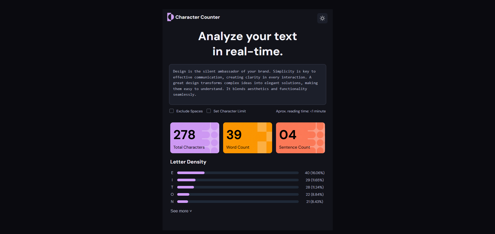
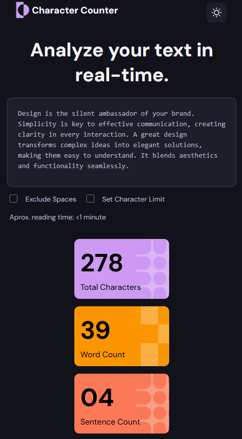
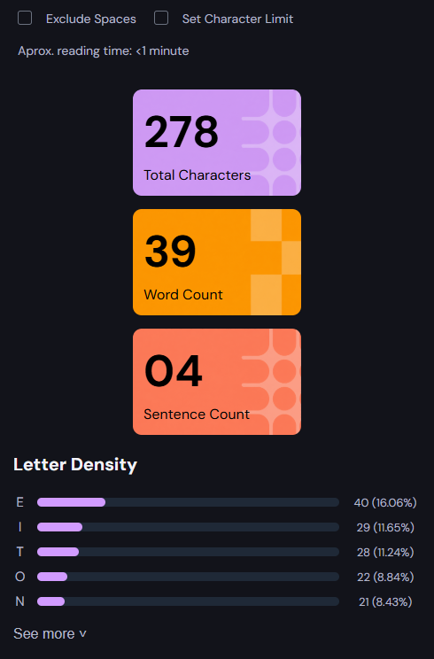

# README

## 1. Objetivo del proyecto

El objetivo del proyecto fue recrear una interfaz de “Character Counter” utilizando HTML y CSS. La página permite visualizar estadísticas de un texto como cantidad de caracteres, palabras, oraciones y densidad de letras, además de practicar diseño responsive y alineación de componentes.

---

## 2. Tecnologías utilizadas

* HTML5 para la estructura del sitio.
* CSS3 para estilos y diseño responsive.
* Google Fonts (DM Sans) para la tipografía.
* Flexbox y Media Queries para adaptar el diseño a diferentes tamaños de pantalla.

---

## 3. Cómo se organizó el HTML

El HTML fue dividido en secciones semánticas para mantener una estructura clara y ordenada:

* `header` para el logo y botón de configuración.
* `textarea` para el ingreso del texto.
* `section` para las tarjetas de estadísticas.
* `section` para el área de densidad de letras.

También se utilizaron `div`, `span` y clases específicas para facilitar el estilizado y la organización visual.

---

## 4. Cómo se resolvió el CSS

El CSS se organizó por secciones siguiendo la estructura del HTML. Se utilizaron variables CSS (`:root`) para manejar colores globales y mantener consistencia visual.

Para la distribución de elementos se usó principalmente Flexbox, logrando alineaciones horizontales y verticales. Además, se implementaron Media Queries para hacer el diseño responsive en dispositivos móviles, adaptando tamaños y reorganizando las cards en columna cuando el ancho de pantalla disminuye.

---

5. Dificultades encontradas

Una de las principales dificultades fue trabajar con la etiqueta progress, ya que no conocía su sintaxis ni la forma correcta de personalizarla con CSS. Fue necesario investigar cómo funcionaba y realizar varias pruebas hasta lograr el resultado esperado.

Otra dificultad fue centrar correctamente la imagen dentro del botón del header. Aunque el botón estaba alineado, la imagen no se posicionaba como esperaba, por lo que tuve que experimentar con Flexbox y propiedades de alineación hasta solucionarlo.

---

## 6. Capturas del resultado final

### Vista Computadora

### Vista Mobile

